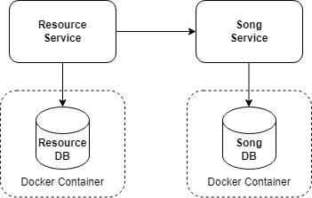
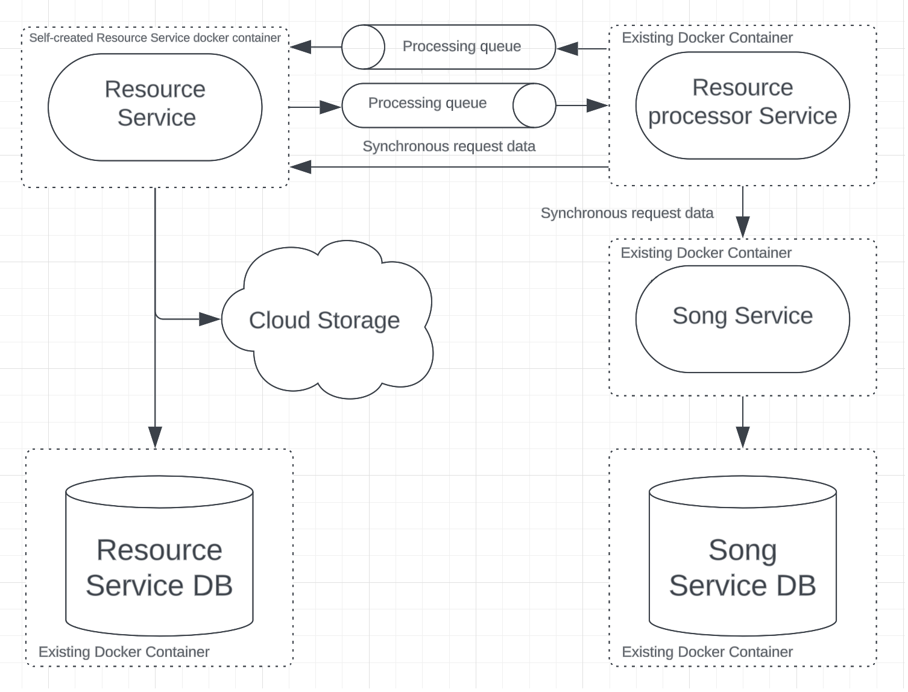
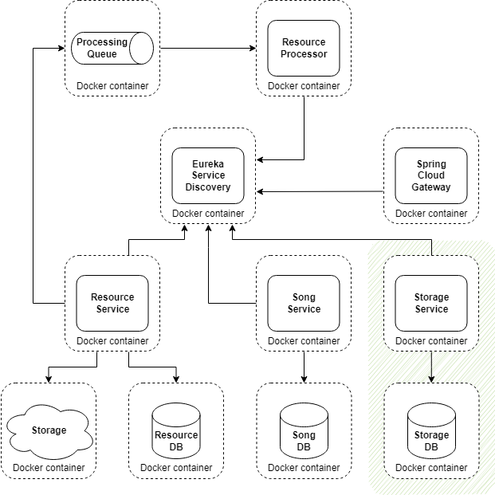
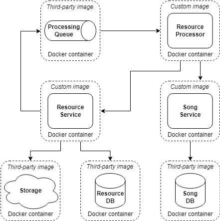
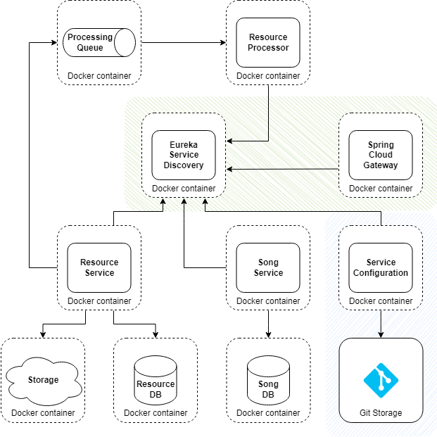
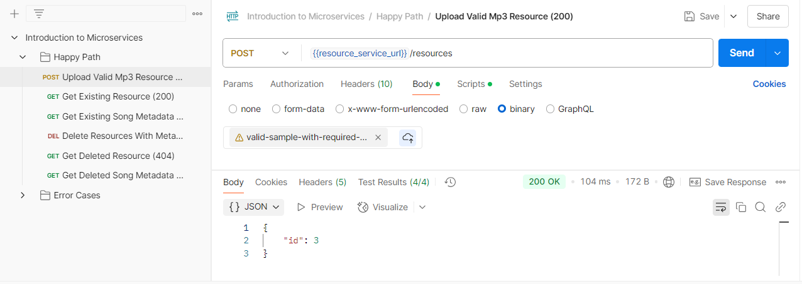

# Microservices Audio Platform

> A scalable, containerized microservices architecture for MP3 processing and metadata management.

[]()
[]()
[]()
[]()
[](https://github.com/PashaPoliak/Microservices/actions/workflows/allure.yml)
[](https://github.com/PashaPoliak/Microservices/actions/workflows/build.yml)
[](https://github.com/PashaPoliak/Microservices/actions/workflows/ci.yml)

---

## 📐 Architecture Overview

<div align="center">
  
</div>

**Core Services**

- **Resource Service** — MP3 storage & processing (S3 + DB)
- **Song Service** — Metadata management
- **Resource Processor** — Async metadata extraction via RabbitMQ
- **Gateway** — API gateway + routing (Spring Cloud Gateway + Eureka)
- **Discovery Service** — Eureka service registry (port 8761)
- **Config Service** — Git-backed Spring Cloud Config Server (port 8888)
- **Storage Service** — Shared storage operations
- **QA Service** — Integration & E2E testing

---

## 🖼️ Key Diagrams

| Communication                                                  | Fault Tolerance                                      | Containerization                                       | Service Discovery                                |
|----------------------------------------------------------------|------------------------------------------------------|--------------------------------------------------------|--------------------------------------------------|
|  |  |  |  |

---

## 🚀 Quick Start

```bash
./gradlew clean build
```
# Microservices Audio Platform

```bash
docker compose up -d --build
```

**Run all services locally (correct startup order):**

```bash
./gradlew :config-service:bootRun

./gradlew :discovery-service:bootRun

./gradlew :gateway:bootRun

./gradlew :auth-service:bootRun

./gradlew :resource-service:bootRun

./gradlew :song-service:bootRun

./gradlew :storage-service:bootRun

./gradlew :resource-processor:bootRun

./gradlew :qa-service:bootRun

./gradlew :ui-service:bootRun
```

> **Note:** `ui-service` is a **React/Node.js** project (not Spring Boot). When you run `./gradlew :ui-service:bootRun`, it delegates to the `startReactApp` task which executes `npm start`. Alternatively, you can run it directly: `cd ui-service && npm start`.

**Local dev (without Docker for services):**

```bash
docker compose up -d resource-db song-db storage-db rabbitmq localstack
```
```bash
./gradlew clean build -x test

docker compose up -d config-service discovery-service

docker compose up -d resource-service song-service resource-processor storage-service gateway

curl http://localhost:8761
curl http://localhost:8888/actuator/health  
curl http://localhost:8080/actuator/health
curl http://localhost:8080/resources/actuator/health

docker compose down -v

```

Service Discovery stack (Eureka + Gateway + Git Config) is fully implemented and required for all inter-service
communication and dynamic routing. All clients use `spring.config.import: configserver:...` + Eureka registration

---

## 🧪 Testing

- Unit, Integration, Component (Jbehave), Contract & E2E tests
- Postman collection + sample MP3 files included in `tools/`
- Allure + JBehave reports generated

<div align="center">
  
</div>

---

## 📚 Documentation

- [Introduction & Requirements](tools/docs/Introduction.md)
- [Fundamentals](tools/docs/Fundamentals.md)
- [Communication & Messaging](tools/docs/Communication.md)
- [Containerization](tools/docs/Containerization.md)
- [Testing Strategy](tools/docs/Testing.md)
- [Fault Tolerance](tools/docs/Fault%20tolerance.md)
- [Storage State Machine](tools/docs/State%20Machine.md)

---

## 📁 Project Structure

```
Microservices/
├── resource-service/
├── song-service/
├── resource-processor/
├── gateway/               # + reactive routes, Error handler, discovery.locator
├── discovery-service/     # Eureka @EnableEurekaServer
├── config-service/        # Git-backed Config Server
├── storage-service/
├── qa-service/
├── config-repo/           # Per-service + docker ymls (authoritative)
├── compose.yaml
├── .env
├── tools/
│   ├── images/
│   ├── docs/
│   └── api-tests/
└── README.md
```

---

## ✨ Features

- ✅ Async processing with RabbitMQ + retries
- ✅ Cloud storage (LocalStack S3)
- ✅ PostgreSQL per service (Alpine)
- ✅ Two-stage Docker builds
- ✅ Health checks & proper startup ordering
- ✅ Global error handling & validation (Gateway: structured JSON via WebExceptionHandler)
- ✅ Service Discovery (Eureka + Spring Cloud Gateway + Git Config Server + @RefreshScope)
- ✅ Full API test coverage
- ✅ **Fault tolerance**: Resilience4j Circuit Breaker + Spring Retry, STAGING→PERMANENT state machine, configurable stub
  fallback, S3 health probe

---

## 🚨 Module 7: Observability Pipeline (ELK + Tracing)

### Stack

`Elasticsearch + Logstash + Kibana` | `Micrometer Tracing`

### What was implemented

**Centralized Logging (ELK Stack):**
- ✅ Elasticsearch 7.17.10 — log storage & indexing (`logs-*` indices)
- ✅ Logstash 7.17.10 — TCP/UDP input (port 5000), JSON parsing, Elasticsearch output
- ✅ Kibana 7.17.10 — log visualization & trace ID search (`http://localhost:5601`)
- ✅ JSON-formatted logs via `logstash-logback-encoder` (severity, service, traceId, message)
- ✅ `logback-spring.xml` in all 5 services (gateway, resource-service, song-service, resource-processor, storage-service)
- ✅ `json-file` Docker logging driver (max-size: 10m, max-file: 3)

**Distributed Tracing:**
- ✅ `TraceGatewayFilter` — Injects/generates `X-Trace-Id` at API Gateway ingress
- ✅ `TraceIdInterceptor` — Extracts trace ID from HTTP headers in resource-service & song-service
- ✅ `WebClientTraceConfig` — Propagates trace ID to downstream HTTP calls via `ExchangeFilterFunction`
- ✅ RabbitMQ trace propagation — `X-Trace-Id` header sent with messages, extracted by ResourceProcessor
- ✅ Sleuth/Micrometer Tracing config in `config-repo/application.yml` (W3C propagation, 100% sampling)
- ✅ All logs correlated by `traceId` across Gateway → Resource Service → Storage Service → Song Service → Resource Processor

**Architecture Flow:**
```
[Client] → Gateway (injects X-Trace-Id)
            ├─ Resource Service (intercepts traceId, logs JSON, propagates via WebClient + RabbitMQ)
            │   ├─ Storage Service (logs with traceId)
            │   └─ Song Service (logs with traceId)
            └─ RabbitMQ → Resource Processor (receives traceId, logs with traceId)

[All services emit JSON logs → Logstash → Elasticsearch → Kibana (:5601)]
```

---

# Containerization Implementation Review

### Dockerfiles

- [x] **Two-stage builds**: All 7 Dockerfiles use two-stage builds.
- [x] **`WORKDIR /app`**: All Dockerfiles correctly set `/app` as the working directory.
- [x] **`COPY` for file transfers**: All use `COPY` (not `ADD`) for local files.
- [x] **Wildcard JAR files**: `COPY --from=builder /app/*/build/libs/*.jar app.jar`.
- [x] **Alpine runtime base**: `eclipse-temurin:21-jre-alpine`.
- [x] **Alpine build base**: `gradle:8.8-jdk21-alpine`.
- [x] **`CMD` used**: All 7 Dockerfiles use `CMD ["java", "-jar", "app.jar"]`.
- [x] **`EXPOSE` correct ports per service**: 8888, 8761, 8080, 8081, 8082, 8083, 8085.
- [x] **Dependency caching**: Gradle configs copied before source, `./gradlew :service:dependencies` runs first.
- [x] **`./gradlew` used**: All use the Gradle Wrapper.
- [x] **`assemble --no-daemon -x test`**: Faster builds without tests.
- [x] **Alpine `apk` for curl**: `apk add --no-cache curl` (lightweight).

### Docker Compose (compose.yaml)

- [x] **PostgreSQL 17-alpine**: All DBs use `postgres:17-alpine`.
- [x] **Health checks on all services**.
- [x] **`depends_on` with `condition: service_healthy`**.
- [x] **Environment variables from `.env`**.
- [x] **RabbitMQ + LocalStack** configured properly.
- [x] **`build` used (not `image`)** for microservice containers.
- [x] **Single command deployment**: `docker compose up -d --build`.
- [x] **Service name resolution**: Logical names used.
- [x] **Default network** (no custom `microservices-net`).
- [x] **No named volumes for DB persistence**.
- [x] **`init-scripts/` directory** mounted to `/docker-entrypoint-initdb.d`.

### Application Configuration

- [x] **Spring Config Server integration**: `spring.config.import: configserver:...`.
- [x] **Actuator health endpoints exposed**.
- [x] **Env var fallbacks**: `${VAR:default}` pattern used everywhere.
- [x] **Eureka URLs**: `${EUREKA_URL:http://localhost:8761/eureka/}`.
- [x] **Config server URLs**: `${CONFIG_SERVER_URL:http://localhost:8888}`.
- [x] **RabbitMQ config**: env var fallbacks for host/port/user/password.
- [x] **Resource-processor ports/URLs**: env var fallbacks.
- [x] **storage-service application.yaml**: created with env var fallbacks.

### Infrastructure

- [x] **`.env` file present**.
- [x] **`.dockerignore` files present** for most services.
- [x] **`init-scripts/` directory**: `resource-db/init.sql`, `song-db/init.sql`, `storage-db/init.sql`.
- [x] **SQL scripts only define tables** (no CREATE DATABASE).

---

[Allure](https://pashapoliak.github.io/Microservices/)

http://localhost:9200/_cat/indices?v
http://localhost:5601/app/management/kibana/dataViews
http://localhost:9200/_cluster/health
http://localhost:5601/api/status
http://localhost:4566/_localstack/health
http://localhost:15672/
http://localhost:9090/-/healthy
http://localhost:3090/api/health
http://localhost:9600/
http://localhost:9000/auth/oauth2/token